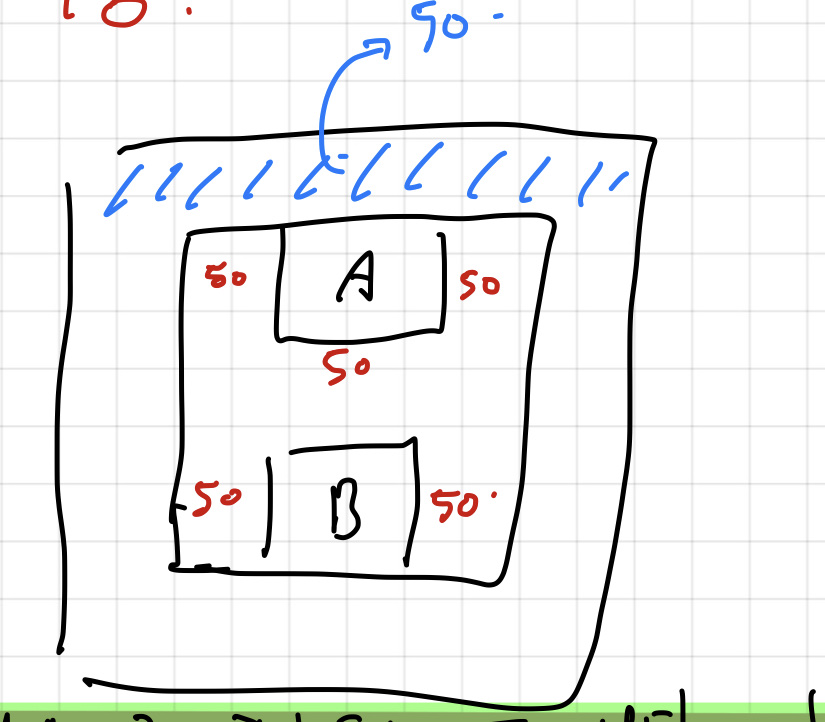

# CSS 기초

### HTML에 CSS 추가하는 방법

1. 같은 HTML파일에 CSS & HTML코드를 배치 => head내에 style태그를 이용한다.

2. CSS와 HTML분리하기 -> 권장되는 방법 (style.css생성 후 link태그의 href속성을 통해 접근 + rel="stylesheet"지정)

rel = relationsip의 약자로, 링크된 파일과의 관계를 설명

### CSS 코드 작성법, 3가지 규칙

1. 셀렉터(selector)가 HTML 태그를 가리킨다.

2. 프로퍼티(property)가 HTML태그의 속성을 지정한다.

3. CSS => Cascading style sheet임을 기억하자.

(파일을 통해 external CSS를 지정하고, 파일 내부에서 inline CSS를 지정했지만

만약 같은 태그에 대해 이루어진 것이라면?

(**cascading 성질로 인해 아래에 위치한 코드로 결국 적용된다.**)

-   예시)

```css
<style>
    h1{
        color:blue;
    }
</style>
```

-   **프로퍼티 이름은 띄어쓰기가 불가능**하며, 속성 지정시 **콜론(:)**, 속성 지정 후에는 **세미콜론(;)** 표기로 항상 마무리지어야한다.

### Blocks and inlines

-   Blocks의 성질을 지닌 태그들은 옆에 또 다른 block이 오지 못한다.</br>(div, header, main, section 등등)

-   Block과 반대로 inline성질을 지닌 태그들은 옆에 다른 요소가 올 수 있다.

### Margin

-   block을 inline으로 바꾸기 또는 반대의 경우를 진행 -> display프로퍼티 만지기

```css
.box {
    display: inline;
}

.nonbox {
    display: block;
}
```

-   (참고)inline요소는 너비와 높이를 가지지 않기 때문에, **태그 내에 컨텐츠의 크기만큼만 공간을 차지**하며 컨텐츠가 없으면 출력되는 것이 없다.

```html
<!DOCTYPE html>
<head>
    <style>
        header {
            display: inline;
            height: 100px;
            width: 100px;
            background-color: tomato;
        }
    </style>
</head>
<body>
    <header></header>
    <header></header>
</body>
```

-   (참고) CSS설정시 특정 프로퍼티에 대해 값을 할당하지 않은 채 html파일을 생성하면</br>브라우저의 종류에 따라 기본 설정값을 할당받아 생성되게 된다.</br> 그 중 하나로 margin값이 있다</br>

-   margin 프로퍼티에 값을 몇개 할당하느냐에 따라 적용되는 방향이 달라진다.

```css
header{
    margin:10px; <!--box 상 하 좌 우 적용-->
}

header{
    margin:10px 15px; <!--상하 & 좌우-->
}

header{
    margin: 10px 15px 20px 25px; <!--상하좌우-->
}
```

### 여백상쇄란?(Collapsing Margin)

> 여러 블록의 위쪽 및 아래쪽 바깥 여백(마진)은 경우에 따라 제일 큰 여백의 크기를 가진 단일 여백으로 결합(상쇄)되곤 합니다. 이런 동작을 여백 상쇄라고 부릅니다. 단, 플로팅 요소와 절대 위치를 지정한 요소의 여백은 절대 상쇄되지 않습니다. - MDN

-   쉽게 말해, Block요소가 상 하로 존재하며 상하좌우 height,width 값을 모두 20px로 주었을 때</br>
    </img>

*   위의 이미지와 같이 윗 블록 요소의 하단부, 아래 블록 요소의 상단부가 겹쳐 </br>본래 200px 가 되어야 할 마진 너비가 100px로 상쇄되어 버린 것이 바로 margin collapsing 현상이다.

*   이는 부모-자식 Block요소에서도 발생한다.

```css
.parent {
    margin: 0;
}

.chi {
    margin: 50px;
}
```

-   위와 같은 클래스로 지정된 부모-자식 블록 태그가 있다고 가정하자.

</img>

-   허접하지만 위의 그림을 설명해보자면, 분명 부모 블록 요소의 클래스의 margin값을 0으로 지정했음에도 자식 블록 요소의 margin값이 50px였기 때문에 부모 블록 요소의 상단부에 여백이 생기게 된다.

-   이 경우는 개발자 입장에서 원하지 않는 형태의 구현이 될 수 있기 때문에 </br>해당되는 케이스의 여백상쇄 현상을 일어나게 하지 않기 위해서는 공간을 차지하는 컨텐츠를 넣어줘야된다. </br>하지만 쓸모 없는 텍스트를 집어넣을 수는 없으니 부모 블록 요소에 padding값을 지정함으로써 이를 방지한다.

### paddings and IDs

-   padding opposite margin -> padding은 box의 안쪽공간을 지정한다.

-   같은 요소에 차이를 두는 법 => id attribute 지정 후 </br>
    style태그 내에서 #(해시태그)이용하여 프로퍼티 지정 (#id_name)

```css
#exciting {
    background: linear-gradient(to bottom, #ffe8d4, #f69d3c);
    border: 1px solid #696969;
    padding: 10px;
    border-radius: 10px;
    box-shadow: 2px 2px 1px black;
}
```

### border
