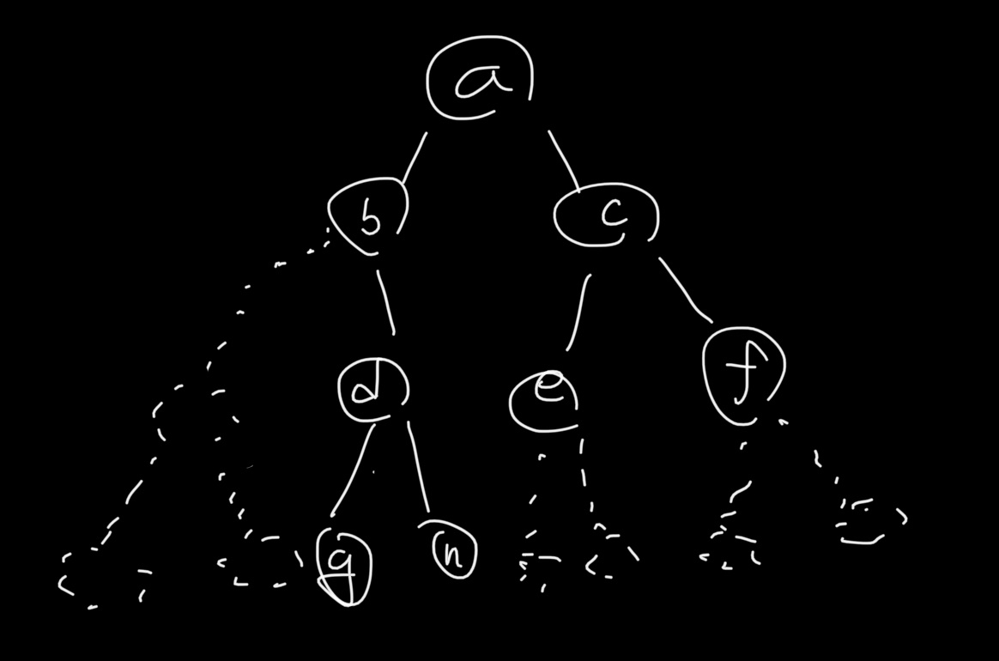

# 트리 자료구조

### 트리란?

-   지금까지 해왔던 자료구조는 **링크를 따라 순차적으로 움직이는 sequential structure**
-   앞으로 배우게 되는 자료구조는 **부모-자식노드 관계에 따라 움직이게 됨. 상-하**

### 이진트리 용어들

1. 루트 노드 (root) - 가장 상위 노드
2. 링크(link), 에지(edge) - 각 노드를 서로 이어주는 선
3. 리프 노드 (leaf) - 각 링크의 가장 하위 노드
4. 레벨 (level) - 부모 노드와 자식 노드 사이의 간격 하나가 1레벨. (루트 노드는 레벨 0 부터 시작)
5. 트리의 높이 - 루트 노드로부터 가장 하위 리프 노드까지 필요한 링크의 수 (루트 노드와 가장 하위 리프 노드의 레벨 차이)
6. 경로(path) - 어떤 노드v ~ w까지 거쳐가는 노드들 (루트 3 -> 2 -> 7 -> 8 -> 12)
7. 경로 길이(path length) - 경로의 에지 개수
8. 부모 노드 (parent node) - 특정 노드의 바로 상위 노드
9. 자식 노드 (child node) - 특정 노드의 바로 하위 노드
10. 형제 노드 - 부모 노드가 동일한 노드

### 표현법



-   리스트 - A = [ a,b,c,None,d,e,f,None,None,h,...... ]

    1. 루트 노드로부터 좌->우 방향으로 순회하면서 리스트에 값을 저장.
    2. 레벨이 증가할 때 해당 레벨만큼 필요한 자식 노드의 개수를 index 계산하여 무슨 레벨인지 파악
        - ex) 레벨이 2인 노드에 접근 -> 리스트의 인덱스 범위가 (2^2-1 ~ 2^3-1 까지)
    3. 노드에 값이 저장되어 있지 않으면 None 저장

-   리스트2 -> **재귀적 표현** A=[ a, [ a의 부트리 ], [ a의 오른쪽 부트리 ] ....]

    -   [a, [b, [], [d, [ ], [ ] ], [ c, [e, [ ], [ ] ]].......]

-   노드 class를 정의
    -   key
    -   자식 노드를 가리킬 link (left, right)
    -   부모 노드를 가리킬 parents
    -   value 등등ㅇ.. 기타의 것들

### 이진 트리 (Binary Tree)

-   표현법

    1. 이진트리 -> 배열, 리스트 (heap)
    2. 노드와 링크를 직접적으로 표현 (노드 클래스를 구성) - Node, Binary Tree class

-   노드 클래스의 선언

```python
class Node:
    def __init__(self,key):
        self.key = key
        self.parent = self.left = self.right = None

    def __str__(self):
        return str(self.key)

def main():
    a = Node(6)
    b = Node(9)
    c = Node(1)
    d = Node(5)

    a.left=b
    a.right=c
    b.parent=a
    c.parent=a
    b.right=d
    d.parent=b
```

**순회 (Traverse)**

1. preorder
2. inorder
3. postorder

-   이진트리 순회 (traversal) : 이진트리 노드의 key값을 빠짐없이 출력하는 방법 -> **재귀적으로 구현!**
-   M노드 : 자기자신, L : M의 left subtree, R : M의 Right subtree

1. preorder : M -> L -> R 순서
2. inorder : L -> M -> R 순서
3. postorder : L -> R -> M 순서

```python
class Node:
    def __init__(self,key):
        self.key = key
        self.parent = self.left = self.right = None

    def __str__(self):
        return str(self.key)

    def preorder(self): # self -> 현재 방문중인 노드
        if self!=None:
            print(self.key)
            if self.left:
                self.left.preorder()
            if self.right:
                self.right.preorder()

    def inorder(self):
        if self!=None:
            if self.left:
                self.left.inorder()
            print(self.key)
            if self.right:
                self.right.inorder()

    def postorder(self):
        if self!=None:
            if self.left:
                self.left.postorder()
            if self.right:
                self.right.postorder()
            print(self.key)
```

-   상황가정) 이진트리의 모양을 모르는 상태.
    1. preorder : F B A D C E G I H
    2. inorder : A B C D E F G H I
-   이로부터 원래의 이진트리의 모양을 복원하는 작업 -> **reconstruct**

### 이진 탐색 트리(Binary search Tree)

-   탐색 기능에 효율적으로 이용되는 자료구조
-   각 노드의 왼쪽 subtree의 key값은 노드의 key값보다 작거나 같아야함.
-   각 노드의 오른쪽 subtree의 key값은 노드의 key값보다 커야함.
-   `A = [15,4,20,None,2,17,32,None,None,None,19,None,None]`
-   **루트노드 뿐만 아니라 모든 노드에 있어서 해당 규칙이 적용되어야 함.**

-   15(루트 노드) > 왼쪽 subtree(4), 15(루트 노드) < 오른쪽 subtree(20)

-   search(19) -> 루트부터(15) 시작 - 15보다 크므로 오른쪽 subtree -> 20보다 작음 - 20의 왼쪽 subtree -> .....

-   level by level로 내려감 -> 한 레벨마다 작을 지 클 지 판단됨 -> O(h), h==height.
-   트리 자료구조 -> height를 최대한 작게 유지 !!!

```python
class BST:
    def __init__(self):
        self.root=None
        self.size=0

    def __len__(self):
        return self.size

    def __iter__(self):
        return self.root.__iter__() # Node class의 iter 스페셜메소드 호출, BST class 말고!!!
    # iter메소드는 제너레이터로 정의하기

T = BST()
T.insert(15)
T.insert(4)
#       15
#   4       None, 4가 15의 왼쪽subtree로 들어가야함. 그렇게 되도록 insert메소드를 구현!!
```

-   find_location 메소드

```python
class BST:
    # .....
    def find_loc(self,key): # key 값 노드가 있다면 해당 노드를 return, 없다면 삽입될 위치의 부모노드를 리턴
        if self.size==0:
            return None
        p = None # 한방향 연결리스트 tail찾기와 비슷한 방식
        v = self.root
        while v!=None:
            if v.key==key:
                return v
            elif v.key < key:
                p = v
                v = v.right
            else:
                p = v
                v = v.left
        # while을 빠져나옴 ->그 동안 따라왔던 부모노드 p를 리턴.
        return p

    def search(self,key):
        v = self.find_loc(key)
        if v == None:
            return None
        else:
            return v

    def insert(self,key):
        p = self.find_loc(key) # : O(h) -> 상수시간
        # p와 v의 링크를 달아줌
        if p==None or p.key!=key:
            v = Node(key)
            if p == None:
                self.root = v # p는 부모노드인데, None이므로 루트노드
            else: # p가 루트노드가 아니면서, p의 key값이 insert할 key와 값이 다르다. - 정상적인 상황
            # insert할 key의 왼쪽에 들어갈 지, 오른쪽에 들어갈 지 모르는 상황
                v.parent = p
                if p.key > key:
                    p.left = v
                else:
                    p.right = v
            self.size+=1
            return v
        else:
            print("key is already in tree") # tree에 존재하는 key값을 다시 insert하려는 시도를 했다고 알려주는 부분
            return p
```

-   삭제연산(delete) : deleteByMerging, deleteByCopying

    -   deleteByMerging(self,x) -> 노드 x를 삭제.
    -   deleteByCopying

-   deleteByMerging(self,x)
    -   왼쪽 subtree를 L, 오른쪽 subtree를 R
    -   삭제한 x 자리에 L이 오도록 함
    -   가장 큰 key값을 가진 노드를 m이라고 할때 해당 노드에 R을 연결한다.
    -   L의 루트노드와 삭제한 x노드의 부모 노드와 link update
-   특수한 경우
    1. a==None -> b가 x를 대체
    2. x == root -> x가 트리의 루트노드가 아니면 L이 그냥 x를 대체하면 됨

```python
# pseudo code
def deleteByMerging(self,x):
    a = x.left
    b = x.right
    c = x자리를 대체할 노드
    m = L에서 key가 가장 큰 노드 # L에서 key값이 가장 큰 노드
    pt = x.parent
    if a!=None:
        c = a
        m = a
        while m.right:
            m = m.right
        if b!=None:
            b.parent = m
            m.right = b
        else: # a==None
            c = b
        # x를 대체한 뒤에 x의 부모와 대체한 노드의 링크를 업데이트

        if pt!=None:
            if c:
                c.parent = pt
            if pt.key < c.key:
                pt.right = c
            else:
                pt.left = c
        else: # x.parent==None -> 루트노드
            self.root = c
            if c: # c가 none이 아니어야함
                c.parent=None

        self.size -= 1
```

-   deleteByCopying
-   삭제할 x노드의 left subtree -> L, right subtree -> R
-   삭제할 x노드의 key값을, L의 가장 큰 key값으로 copy를 진행
-   이후 copy되었던 노드의 left subtree를 하나씩 끌어올려서 대체한다.

-   **deleteByMerging, deleteByCopying 수행시간**

    -   두 함수 모두 L, 즉 삭제할 x노드의 left subtree의 maximum key를 찾는 데에 가장 많은 시간을 사용한다.
    -   최악의 경우 O(h)시간

-   따라서 이진탐색트리에 있어서 insert, search, delete-merging and copying에 있어서 모두 최악의 경우 O(h)시간이 걸린다.
    -   이진 탐색트리의 h에 있어서 수행시간의 차이가 분명 존재할 것이다.
    -   h를 최소화 하도록 강제적으로 하는 이진탐색트리를 **balanced-binary tree**라고 함.
