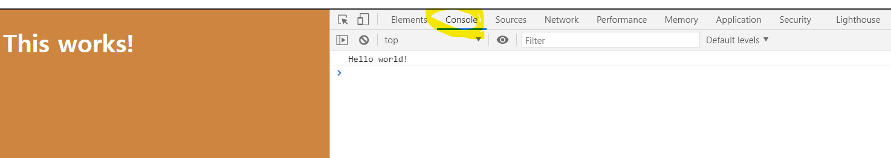

# Theory

### ECMA Script?

-   JS에 ECMAScript - Specification 명칭, 이에 대한 업데이트가 ECS5, ECS6 ...
    -   -> 설명문 같은 역할. (JS 이용에 대한 설명서)

### Vanilla JS

-   JS의 한 종류. Library가 없음 (날 것의 JS)
-   바닐라 JS 학습 이후 Library 및 framework 추가된 JS 학습

### JS 추가하기

-   JS파일은 head에 추가 X
    -   body 맨 마지막에 추가.

```html
<!DOCTYPE html>
<html>
    <head>
        <title>!!</title>
        <link rel="stylesheet" href="index.css" />
    </head>
    <body>
        <h1>!!!</h1>
        <script src="index.js">
            // 이곳에 JS코드를 직접 입력해도 되고, src를 통해 파일을 불러오기도 가능
        </script>
    </body>
</html>
```

-   index.js에 경고 메세지 추가하기

```js
alert("Hello world");
```


-   index.js에 경고 메세지를 console log로 출력하기



### JS Variables

```js
a = 221;
b = a - 5;
console.log(b);
```

-   -> b가 console에 출력됨

-   **주의점**

    -   JS의 모든 코드는 line-by-line으로 작성해야함.
    -   line 대신 expression으로 표현
    -   expression이 끝나는 것을 표현 -> 세미콜론;
    -   위의 코드는 좋은 코드 X

-   변수 만들기
    -   Create -> **let a = 221;**
    -   Initialize
    -   Use

```js
let a = 221; //create and Initialize
let b = a - 5; //이미 생성된 변숫에 대해서는 참조만 하면 됨. a-5에 let 사용 X
a = 4; //just updated a, let 사용하지 않았음
console.log(b, a);
```

### let, const, var

-   값의 상수화를 위해 **const**이용

```js
const a = 221;
let b = a - 5;
a = 4; //TypeError - Assignment to constant variable 에러가 발생할 것, 상수에 대입연산
```

-   **var?** -> let과 같이 값이 변하도록 이용할 수 있지만, **var에 적용되는 특별한 규칙이 존재**

### Data Types on JS

```js
/*
므
므
므
여러줄 주석처리
*/
```

-   **변수 선언은 default로 const이용!!!!!**

```js
//Data Types
// 1. String - 따옴표에 감싸지 않으면 Park이라는 변수를 search하게됨.
const what = "Park";
const what = "이모티콘들도 가능합니다.";

// 2. Boolean - 참, 거짓
// true==1, false==0
const what = false;
const what = true;

// 3. number
const what = 123;

// 4. number -> float
const what = 55.1;
```

### Organinzing Data with Arrays - JS에서 데이터 정렬하기.(array이용)

1. Array - 자바스크립트 작성을 위한 규칙이 존재.
    - **변수명을 항상 Camel Case로 작성!!!!**
    - 변수명에 space 대신에 대문자로 작성
    - lower of week -> lowerOfWeek
2. Object

```js
const monday = "Mon";
const tue = "tue";
const wed = "wed";
const thu = "thu";
const fri = "fri";
// string들을 하나로 묶기?
// array선언
const daysOfWeek = ["Mon", "Tue", "Wed", "Thu", "Fri", "Sat", "Sun"];
console.log(daysOfWeek); //[]형태로 출력됨
// Data Types 섞어서 사용 가능함.
const typeOfData = [false, 1, "Monday", 3.5];
console.log(daysOfWeek[2]); //Index 넘어설 시 undefined
```

### Organizing Data with Objects - 데이터 정렬하기(Object이용)

-   array와 다른 점 -> 각 value에 이름 부여 가능 (python의 딕셔너리?)
-   **Object 선언 시 {} 이용** - 실제 객체를 만듦.
-   원하는 data에 label을 부여

```js
const parkInfo = {
    name:"박경준",
    age:24,
    gender="Male",
    isHandsome:True
}
console.log(parkInfo.gender); //parkInfo의 gender에만 접근하기
parkInfo.gender="Female";
console.log(parkInfo.gender); // Female이 출력됨. const인데 값이 변한다?
```

-   JS의 object는 const선언되어도 **const안에 있는 값을 바꿀 수 있다.**
-   const선언된 parkInfo를 아예 다른 dataType으로 바꾸는 것은 불가능.
-   const선언된 parkInfo object의 내용은 바꿀 수 있음.
-   **object를 array안에 넣을 수 있음.**
-   **object안에 array를 넣을 수도 있음.**

```js
const movieName = {
    favmovies: ["신과함께", "호옹이"],
    favFood: [{name:"Kimchi", fatty:false}, {name:"Cheese",fatty:true}];
}
console.log(parkInfo.favFood[0].name);
```

-   object 안에 -> array생성, 그 안에 -> 각 value가 object이도록 선언

-   **object 선언 시 콤마 빼먹지 말기!!!**
