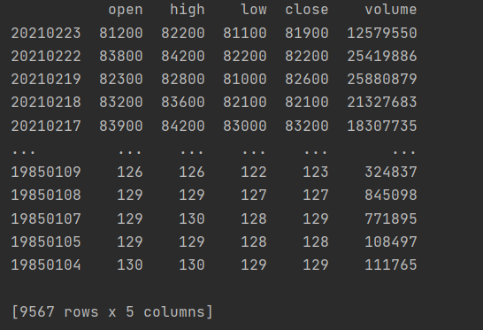

# 증권사 Open API 활용하여 일별 종목 데이터 가져오기

-   pycharm에서 open API 함수파일 Run 후 계좌 번호 불러온 상태에서 진행.

-   첨부되었던 2-2파일 내 get_daily_data.py 파일 run

```python
import sys
from PyQt5.QtWidgets import *
import openapi


class get_daily_data():
    def __init__(self):
        self.api = openapi.Openapi()
        self.run()

    def run(self):
        # get_total_data : 특정 종목의 1985년 이후 특정 날짜까지의 주가 데이터를 모두 가져오는 함수
        # 첫 번째 parameter : 종목코드 (ex.  005930 : 삼성전자 종목 코드) *종목별 코드 번호 존재
        # 두 번째 parameter : 데이터를 가져올 최종 날짜 설정

        data = self.api.get_total_data('005930', '20210223')

        # open : 시작가
        # high : 최고가
        # low : 최저가
        # close : 종가
        # volume : 거래량

        print(data)


if __name__ == "__main__":
    app = QApplication(sys.argv)
    get_daily_data()
```

-   data = self.api.get_total_data('005930', '20210223')

-   위 코드의 20210223이 21년 2월 23일기준 005930의 종목코드를 가진 주식의 주가 데이터를 1985년부터 수집하여 시각화 해주는 함수파일.

</img>

