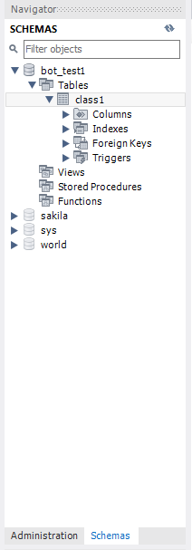
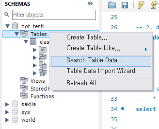
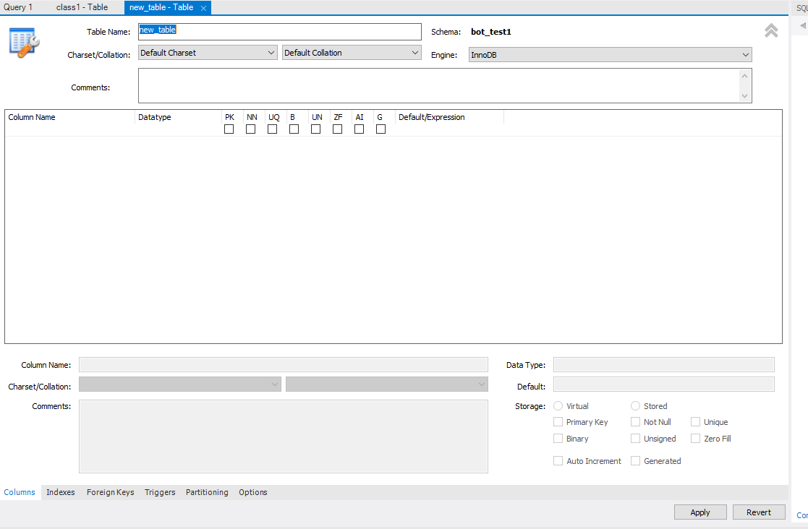

# 쿼리문 사용 방법(select, update, delete, drop, create)

-   mySQL workbench 들어가기

-   데이터베이스 ? 엑셀에서의 파일 이름이라고 간단하게 생각

-   query? 데이터베이스에 요청하는 명령어

-   table? 엑셀에서 sheet에 해당하는 개념. -> 독립적인 데이터들을 만들어서 활용하고 싶을 때 사용

-   CRUD? Create, Read, Update, Delete

-   Work Bench 명령어

    1. Ctrl + enter -> 코드 라인실행

    2. Ctrl + / -> 커서기준 오른쪽 주석처리

```sql
create database bot_test1; -- 데이터베이스 만들기

create database test_dat2; -- 데이터베이스 하나 더 만들기

drop database test_dat2; -- 데이터베이스 삭제하기

```

-   좌측메뉴 -> Schemas 클릭해야 현재 다루고 있는 데이터베이스들 확인 가능!

</img>

-   database의 Table 만들기

</img>

-   데이터베이스 - Tables - create Table 클릭

</img>

1. 테이블 이름 입력

2. column name 아래 공간 클릭하여 column 이름 입력하기

3. Datatype (자료형 고르기)

    - 다양한 자료형이 있지만, 이에 대한 공부는 따로하기로

    - varchar() 자료형 안에 들어가는 값은 byte값으로, 1바이트당 영문자 1개

4. 네모박스들 중 PK, NN에 대한 것까지만 배웠음

    - PK : Primary Key -> 칼럼에 대한 속성으로, 칼럼 각 값이 고유해야하고 그렇지 못하면 오류발생

    - NN : Not Null -> 결측치가 있으면 오류 발생

5. Apply 클릭

### query문을 통해 테이블 데이터 만지기

-   select \* from database_name.table_name; -> 데이터베이스의 지정 테이블로부터 컬럼 **전체 뽑아오기**

-   select column_name from database_name.table_name -> 데이터베이스의 지정 테이블로부터 **지정 컬럼 뽑아오기**

-   select column1, column2 from database_name.table_name -> 데이터베이스의 지정 테이블로부터 **지정 컬럼 여러개 뽑아오기**

-   select column from database_name.table_name where age>10; -> 데이터베이스의 지정 테이블로부터 **지정한 컬럼 값들중 age 컬럼의 값이 10보다 큰 값들로 이루어진 컬럼**

-   update database_name.table_name set age=12 where number=1; -> 데이터베이스의 지정 테이블 중 **number라는 컬럼의 값이 1인 age에 대해 값을 12로 수정**

-   delete from database_name.table_name where number=1; -> 데이터베이스의 지정 테이블 중 **number라는 컬럼의 값이 1인 row를 삭제**

-   _주의_ -> update 및 delete는 컬럼의 속성이 PK, 즉 고유한 값들로 이루어져 있어야 한다.

    -   고유한 값이 아닌 컬럼, 예를 들어 이름이라는 속성으로 delete나 update를 진행하면 동명이인이 있을 수 있고 따라서 데이터의 수정을 함에 있어서 잘못 수정할 경우가 발생한다.

```sql
create database bot_test1;
create database bot_test2;
drop database bot_test2;

select * from bot_test1.class1 where age>10;
-- 컬럼 고르기
select name from bot_test1.class1;
-- name 컬럼만 고르기
select name,age from bot_test1.class1;
-- name, age컬럼 고르기
update bot_test1.class1 set age=12 where number=1;
-- number컬럼이 1값을 가지는 row에 대해 age컬럼의 값을 12로 수정 (고유)
delete from bot_test1.class where number=1;
-- number컬럼이 1값을 가지는 row를 삭제

```
