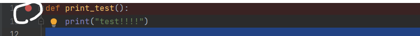
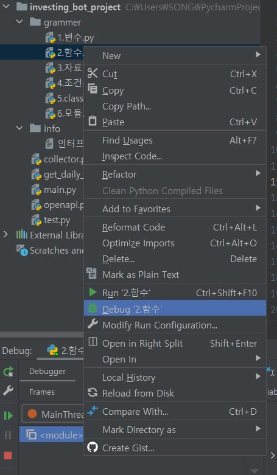
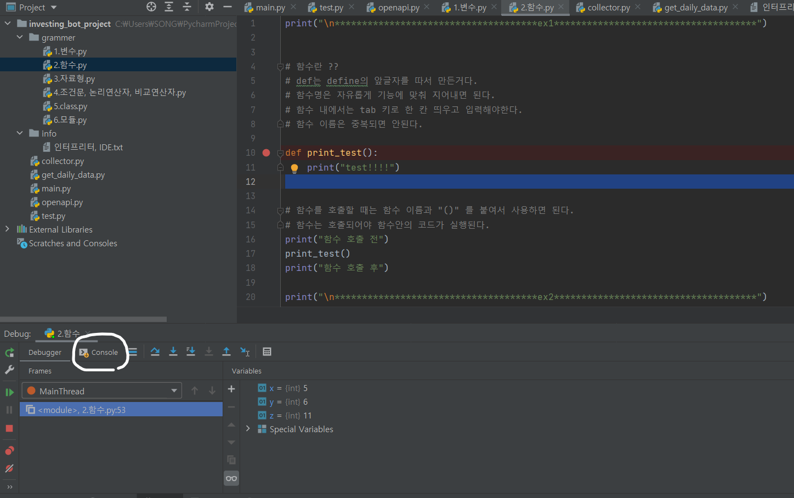
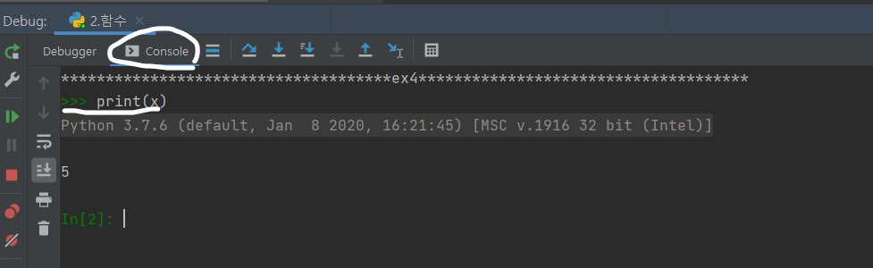
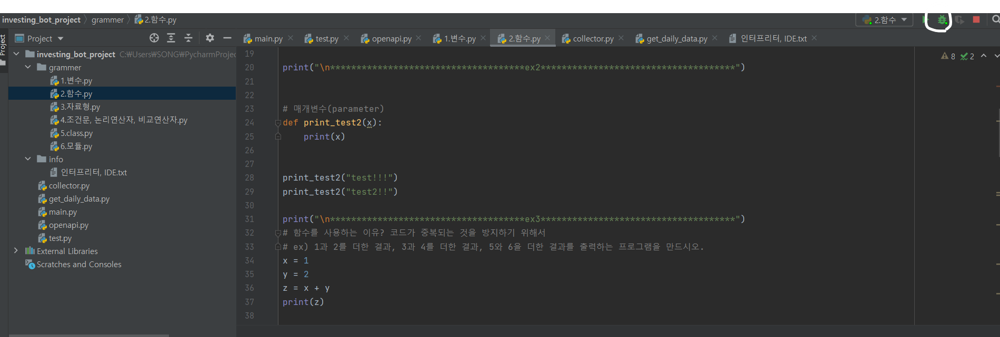
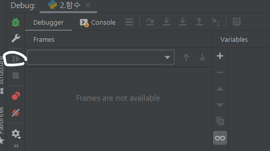

# 인터프리터와 IDE(디버깅 사용법)

### 인터프리터와 IDE란?

-   인터프리터(Interpreter) => 번역기라고 이해하기

    -   프로그래밍 언어의 소스코드를 바로 번역하여 실행하는 컴퓨터 프로그램 또는 환경

-   대화형 인터프리터 -> python console....

    -   입출력이 곧바로 이루어져 직관적

    -   코드가 길어지면 관리가 어려움

-   IDE (Integrated Development Environment) -> pycharm

    -   개발을 하면서 사용되는 도구들의 집합

-   디버깅

    -   프로그램 실행 도중 break point(중단점) 지점에서 끼어들어 상세 과정을 살펴볼 수 있다.

    -   .py 파일 우클릭하여 Debug 클릭

    -   Debugger 탭에서 현재 변수들에 어떤 값이 저장되어 있는지 확인

    -   console 탭에서 대화형으로 디버깅 가능

    -   다시 실행하고 싶으면 우측상단 디버그 버튼 클릭

</img>

-   중단점 -> 라인넘버와 코드 왼편 사이 공간 클릭시 빨간 점 생성

</img>

-   .py 우클릭 -> Debug 클릭

</img>

-   디버그 시작 후 하단에 tab 확인 -> Debugger 탭 Variables에 나와있는 현재 저장된 변수들, 값 확인

-   Console 클릭-> 대화형으로 디버깅. (저장되어 있던 x변수의 값을 출력해보았다)

</img>

-   Debug 버튼 클릭하여 새로 디버그 시작하기

</img>

### 디버거의 다양한 기능들

-   Step Into my code(Alt + Shift + F7) 내가 작성한 현재 코드 내에서 한줄씩 실행. 사용자 정의 함수를 호출할 시 함수로 커서가 이동함

-   Step Over(F8) 현재 코드 내에서 한줄씩 실행하되, 사용자 정의 함수 호출시에도 함수로 커서가 이동하지 않음.

-   Step out(Shift + F8) 현재 위치한 메소드에서 탈출하여 다음 실행구문으로 넘어감

    -   사용자 정의 메소드를 탐색중이었다면, step out을 통해 메소드 탐색을 바로 마치고 다음 실행 구문으로 넘어감

    -   메소드 탐색이 깊어질 때 이용

-   Run to Cursor(Alt + F9) 지정한 커서까지 바로 디버깅 진행

-   Resume Program 다음 중단점까지 디버깅

</img>
