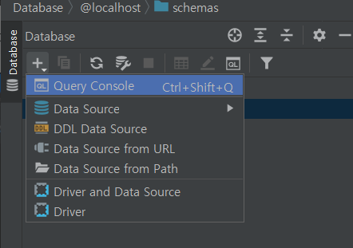
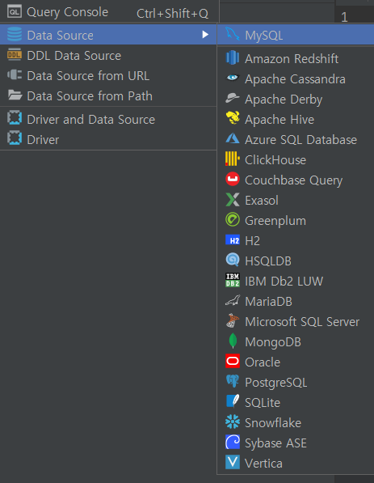
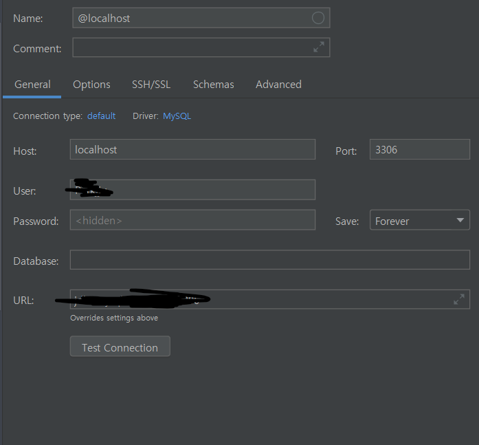
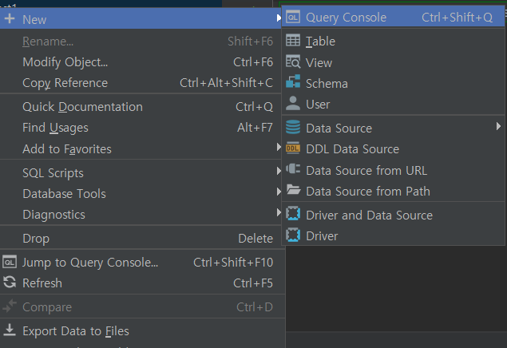

# 주식 기본 용어 정리 및 datagrip 설치

-   시가(open) - 오전 9시 주식장 시작할 때의 가격
-   종가(close) - 오후 3시 30분 주식작 마감 시의 가격
-   고가(high) - 일 중 가장 높을 때의 가격
-   저가(low) - 일 중 가장 낮을 때의 가격
-   거래량(volume) - 주식이 거래된 양

-   양봉과 음봉

    -   양봉과 음봉에 대한 구분은 **당일 시가로부터 상ㅇ승과 하락에 따라 구분**
    -   시가보다 가격이 올라가면 양봉, 내려가면 음봉으로 주식 차트에 표현

-   양봉(상승) -> 빨간 색
-   음봉(하락) -> 파란 색

-   양봉 막대 위꼭지 -> 고가
-   양봉 막대 아래꼭지 -> 저가
-   양봉 아랫변 -> 시가
-   양봉 윗변 -> 종가
-   음봉은 반대개념!

-   이동 평균선의 의미

    -   n일 이동평균선 -> n일간의 주가를 평균낸 값
    -   ex) 1월 1일~ 1월 5일까지 5일기준 이동평균!
    -   주말에 장이 열리지 않는다는 사실을 고려하면, 한 달간 사람들이 주식을 사고판 평균 가격이 20일 이동평균이라고 봄

-   일자별 이동평균치를 선으로 연결한 것이 이동평균선

### datagrip 설치 & dbeaver 설치

-   둘 다 유용하게 이용할 수 있는 데이터베이스 툴 (datagrip은 30일 무료, dbeaver은 완전무료)

-   강의에서 제공하는 것은 일단 datagrip이므로, dbeaver에 대한 학습은 데이터베이스에 대해 친숙해진 뒤에 하기로

-   평가판 선택 뒤 모두 default로 설치

-   Database의 플러스 버튼 -> Data source -> mysql

-   위와 같이 창이 뜨는데, mysql 사용자 이름 및 패스워드 입력 후 Test Connection 진행하면,

    1. 처음에는 Driver 설치를 진행하라고 뜸

    2. Driver 설치 이후에는 set time zone 에러가 발생

    3. time zone 설정 후 apply - ok 진행하면 mysql 연동 완료

### datagrip 갖고 놀기

-   query console 클릭하여 **해당 데이터베이스에 대한 콘솔 생성**

-   해당 데이터베이스에 대한 콘솔이기 때문에 클래스 또한 다른 데이터베이스에서 이름이 같더라도 현재 열려있는 콘솔의 데이터베이스에서만 작동한다.
