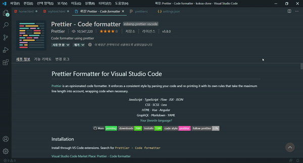
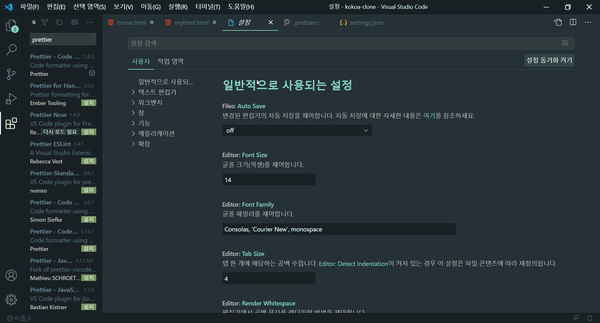
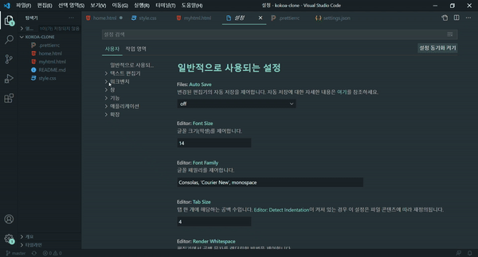

# vscode Prettier 셋업하기

-   HTML코드를 작성하다보면 줄바꿈이나 태그를 여닫는데에 있어서</br>실수슬 범하기 쉽다.</br></br>그런 상황을 미연에 방지하기 위해 vscode extension - prettier를 설치해준다.</br> vscode확장프로그램으로 prettier를 설치하면</br>코드 작성 후 저장 시 자동으로 코드를 수정해준다.</br>(줄바꿈 및 태그 작성 시 기본적인 부분에서 실수한 것들)</br>

</img>

-   확장 프로그램을 설치 완료 하였다면 </br> 기본적인 설정을 만져줘야 제대로 작동한다.</br>

1. format on save 체크하기.

</img>

2. default formatter 체크하기

</img>

-   1번과 2번 과정 진행 중에 prettier가 잘 작동된다면 다행이지만 </br>그렇지 않다면 마지막으로 한번 더 진행할 과정이 있다.</br></br>

3. .prettierrc파일 생성

-   prettier extension 설치 후 .prettierrc파일을 생성해준다.

</img>

```
{
    "singleQuote": true,
    "semi": true,
    "useTabs": false,
    "tabWidth": 2,
    "trailingComma": "all",
    "printWidth": 80
  }
```

[prettier 수정 양식 커스텀설정](https://prettier.io/docs/en/options.html)
