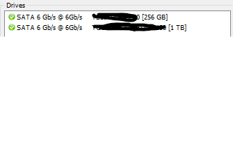

# Module Introduction

## The Modern Computer

### Introduction to Computer Hardware

-   모니터, 키보드 등.. 물리적 구성요소들을 통틀어 하드웨어라 칭함

-   ports? - Connection points that we can connect devices to that extend the functionality of our computer

-   CPU(Central Processing Unit) : The brain of our computer, it does all the calculations and data processing.

-   RAM(Random Access Memory) : Our computer's short-term memory

-   Hard drive : Holds all of our data, which includes all of our music, pictures, applications.

-   Motherboard : It holds everything in place and lets our components communicate with each other. -> foundation of computer

    -   The body of circulatory system of the computer that connects all the pieces together.

-   power supply : Converts electricity from our wall outlet onto a format that our computer can use.

### Programs and Hardware

-   Programs - Instructions that tell the computer what to do
-   인간이 컴퓨터와 소통하기 위해서는 인간의 언어를 machine language로 번역해야함! (Binary)

-   RAM에 대한 설명

*   **RAM is memory that is randomly accessed, allowing our CPU to read from any part of RAM as quickly as any other part.** - 램은 자신의 어떤 부분에서든지 CPU가 다른 컴포넌트만큼 빠르게 읽을 수 있는 랜덤 액세스 메모리
    1. 요리를 위해 요리사를 고용 (CPU)
    2. 요리사가 처리하기 용이한 요리에 대해서는 쿡북을 읽으며 요리하는 것보다 혼자 요리하는 것이 더 빠름(RAM)
        - "Remember that RAM is our computer's short-term memory. It stores Information in **a location our CPU can access faster than it could with our hard drive.**
    3. 요리사에게 요리 레시피를 골라 전달하는데, 효율적인 instructions 전달을 위해 각 순서에 따라 한 라인씩 전달한다. (one line at a time) + 요리사에게 전달하는데, 요리사가 알아먹는 형식은 Binary형식이므로, 변환하여 전달해야한다. (복잡한 과정. ) => "Our CPU is constantly taking Instructions and executing them."

-   EDB - External Data Bus

    -   It's a row of wires that interconnect the parts of our computer, kind of veins in our body.
    -   EDB를 통해 voltage(전압)을 보내면 1, 없으면 0임.(on&off)
    -   즉 byte는 EDB를 통해 컴퓨터 내부에서 움직인다.
    -   EDB는 다양한 사이즈가 존재한다. (8bit, 16,32,64까지도 존재)
    -   8bit EDB를 가정하고, 1바이트 데이터를 CPU에 전달하는 상황
        -   CPU 내부의 레지스터가 CPU가 받은 데이터를 저장할 수 있게 해줌
        -   1+2=3을 저장 -> 1이 register a, 2가 register b, 덧셈의 결과인 3이 register c에 저장.

-   MCC - Memory Controller chip

*   [What is the Memory Controller?](https://www.easytechjunkie.com/what-is-the-memory-controller.htm)

    -   HDD로부터 전달된 RAM의 데이터는 너무 방대하기때문에, EDB를 통한 1바이트 통신에 더하여 또 다른 컴포넌트의 도움이 필요하다. MCC!
    -   MCC는 CPU와 RAM 사이의 다리와 같은 역할을 함

    *   **It manages read and write operations with system memory, along with keeping the RAM active by supply the memory with electric current.**

*   Address bus

    > 주소 버스(address bus)는 일정한 메모리 번지를 찾는 데 사용되는 신호를 운반하는 컴퓨터 내의 배선 버스이다. 간단히 말해 물리 주소를 지정하는 데 쓰인다.

*   주소 버스는 CPU와 MCC를 연결하여 주소를 주고받는다. (데이터 자체를 주고받는 것이 아님.)

*   **정리**

1. CPU의 데이터 요청
2. HDD로부터 RAM에 데이터가 전달됨
3. CPU가 요청한 데이터에 대해 MCC가 Address bus로부터 데이터 주소를 받아와 EDB를 통해 CPU에 전달.
4. 데이터 접근 후 처리

-   [한빛 미디어 - 뇌를 자극하는 윈도우즈 시스템 프로그래밍 中 버스부분 발췌](https://www.youtube.com/watch?v=bGPYyVAXG9I&list=PLVsNizTWUw7E2KrfnsyEjTqo-6uKiQoxc&index=2)
-   CPU와 RAM 데이터 이동에서의 버스 시스템

    1. 데이터 버스 - 데이터가 이동
    2. 어드레스 버스 - 데이터 주소의 이동
    3. 컨트롤 버스 - 컨트롤 신호의 이동 (CPU와 RAM 사이의 데이터 이동은 양방향임을 기억하자)

-   Cache

    -   RAM은 CPU입장에서 데이터 처리 속도가 그렇게 빠르지 않다. (RAM 내부의 트랜지스터가 on 되려면 off에서 충전되어야함)
    -   따라서, 자주 사용되는 데이터를 CPU 캐시 메모리에 저장하여 빠르게 접근한다.
    -   CPU 내부에서 cache level은 L1, L2, L3로 쪼개진다.
    -   L1 -> 가장 작고 가장 빠름

-   CPU clock
    -   [What is CPU clock?](https://www.quora.com/What-is-a-CPU-clock)
    -   "CPU clock is for measuring the speed of processor."
    -   CPU 클럭은 clock wire에 연결되어있다.
    -   데이터를 전송하거나 전달받을때, clock wire에 전압을 보내 CPU가 계산을 시작할 것이라는 것을 알림.
    -   voltage가 clock wire로 보내지는 한 단위가 clock cycle이다.
    -   CPU 속도를 표기할 때에 3.4ghz로 말하는 것은 clock cycle이 초당 34억회 진행된다는 것(Maximum, 항상 이러한 속도로 사이클이 돈다는 것 X)
    -   CPU maximum clock cycle을 초과할 수도 있는데, 이를 **CPU Overclock이라고함.** - "in order to perform more tasks."
    -   빡센 게임을 돌릴 때 발생한다고 생각하면 됨 (CPU에 발열이 발생)
    -   [wiki - CPU cache](https://en.wikipedia.org/wiki/CPU_cache)
    -   [digitaltrends - How to overclock your CPU](https://www.digitaltrends.com/computing/how-to-overclock-your-cpu/)

## Components

### CPU

-   명령어 집합(instructionset architecture, ISA) - 마이크로프로세서가 인식해서 기능을 이해하고 실행할 수 있는 기계어 명령어이다. 명령어 집합 구조는 자료형, 명령어, 레지스터, 어드레싱 모드, 메모리 구조, 인터럽트, 예외 처리, 외부 입출력을 포함한 프로그래밍 관련 컴퓨터 아키텍쳐의 일부이다.
-   [wiki - 명령어 집합 참고](https://ko.wikipedia.org/wiki/%EB%AA%85%EB%A0%B9%EC%96%B4_%EC%A7%91%ED%95%A9)
-   The transition book is called an instruction set, which is literally just aa list instructions that our CPU is able to run. -> 명령어 집합은 CPU가 실행할 수 있는 명령어
-   Every single program on your computer, while extremely complex, is broken down into very small and simple instructions found in our instruction set.
-   Instruction sets are hard-coded into our CPU.

    -   Hard-coding : 하드코드를 사용한 프로그래밍 방식.
    -   하드코드는 변수에 담지 않거나, 리터럴 그대로 프로그램 소스로 기록하여 고정된 형태의 코드로 표현한 것
    -   하드코드 예시 -> `password = 123;`
    -   하드코드의 반대 -> soft coding : 변수에 담아 간략하게 표현할 수 있거나, 유동적인 값을 표현하거나, 사용자의 입력이 요구되는 보안이 필요한 정보 등에 사용
    -   예시) `SECRET_CODE = 123;` , `password = SECRET_CODE;`
    -   CPU내의 명령어 집합이 하드코딩 되어있기 때문에 제조사마다 명령어 집합을 다르게 CPU를 제작할 수 있다.(기능 자체는 동일)

-   CPU는 또한 마더보드와 호환되는지 알아야한다.

    -   [wiki - 우리가 메인보드라고 알고있는 마더보드](https://ko.wikipedia.org/wiki/%EB%A9%94%EC%9D%B8%EB%B3%B4%EB%93%9C)
    -   CPU가 마더보드에 장착되는 방식은 소켓마다 상이하다.
    -   CPU가 마더보드 소켓에 올바르게 장착되었는지 확인해야함.
    -   [CPU 소켓 - LGA, PGA, BGA?](https://m.blog.naver.com/PostView.nhn?blogId=wksmsrltk&logNo=220961411751&proxyReferer=https:%2F%2Fwww.google.com%2F)
    -   LGA -> 마더보드 CPU소켓에 튀어나온 핀이 있어서, LGA에 호환되는 CPU의 홈과 맞춰 끼우면 구동됨 (PGA는 반대의 경우)

-   CPU 장착시, CPU를 냉각하기 위한 장치도 마련해야함

    -   [히트싱크](https://ko.wikipedia.org/wiki/%ED%9E%88%ED%8A%B8_%EC%8B%B1%ED%81%AC)
    -   CPU의 열을 흡수하여 발산하는 장치

-   CPU 32비트 vs 64비트 아키텍쳐
    -   [64비트 32비트 CPU와 운영체제에 대하여](https://eine.tistory.com/entry/64%EB%B9%84%ED%8A%B8-32%EB%B9%84%ED%8A%B8-CPU%EC%99%80-%EC%9A%B4%EC%98%81%EC%B2%B4%EC%A0%9C-%EC%97%90-%EB%8C%80%ED%95%98%EC%97%AC)
    -   컴퓨터의 워드 사이즈 (Word size)란, **데이터 기본 처리 단위이다.** CPU 32비트, 64비트 구조를 말하는 것은 컴퓨터의 워드 사이즈를 말하는 것이다. 64비트 머신은 32비트 머신보다 한 번에 처리할 수 있는 데이터의 양이 두배 많다는 것이다.

### RAM

-   We use RAM to store data that we want to access quickly. This data changes all the time so it isn't permanent.
-   RAM에는 빠른 접근이 필요한 데이터들을 저장하며, 항상 RAM 내의 데이터는 변하므로 영구적이지 않다. -> volatile (휘발성)
-   프로그램을 실행하려면 HDD에 저장되어있는 데이터들을 RAM으로 복사하여 CPU가 처리할 수 있도록 해야한다.
    -   [paging 기법](https://ko.wikipedia.org/wiki/%ED%8E%98%EC%9D%B4%EC%A7%95)
    -   [Quora - How is information loaded from Hard Drive to RAM?](https://qr.ae/pGvW0H)
-   RAM type
    -   DRAM - commonly found in computers. (Dynamic random access memory)
        -   1과 0이 전달되면 각 비트를 축전기로 보냄.
        -   1이면 축전기를 충전시키고, 0이면 안함
    -   DRAM을 탑재할 수 있는 모듈->DIMM(Dual Inline Memory Module)
    -   SDRAM - 시스템 클럭 속도에 동기화되어 데이터를 더 빠르게 처리하는 램
        -   CPU 클럭이란 - CPU 속도를 나타내는 단위. 1초동안 파장이 한번 움직이는 시간
    -   오늘날 RAM -> doubled data rate SDRAM == DDR
        -   DDR1 부터 DDR4까지 다양함
        -   기존 SDRAM보다 용량이크고 전력 소비량이 적으며, 빠르다
    -   RAM도 CPU와 마찬가지로 마더보드와 호환이 되는지 확인해야함

### Motherboards

-   컴퓨터를 하나로 묶는 기반.
    -   expansion cards를 추가할 수 있게 하여 컴퓨터의 기능적 측면에서 확장 가능성을 제공
    -   서로 다른 컴퓨터 부품들을 함께 상호작용 할 수 있게 해줌

*   마더보드의 중요 특징들 (모든 마더보드 공통점)
    1. chipset - 마더보드 내에 두 가지 칩으로 이루어져있음
        - CPU & RAM 및 그래픽 카드들을 상호 연결하는 **Northbridge** - 노스브리지
        - 데이터 입출력을 위한 하드 드라이브 & peripherials - 주변기기(키보드, 마우스 등) & 입출력 컨트롤러 (USB장치)들을 위한 **Southbridge** -사우스브리지
        - 최신 CPU같은 경우 Northbridge가 CPU에 직접 통합되어 별도의 노스브리지 칩셋이 없다고 함. (BGA방식 CPU - 랩탑 및 부피가 작은 디바이스에 사용)
    2. Allows the use of expansion slots.
        - 확장 슬롯을 통해 마더보드에 추가 부품을 장착
        - 오늘날 확장 슬롯의 표준은 PCIe (PCI Express, Peripheral Component Interconnect Express)
    3. form factor (폼 팩터)
        - 오늘날의 이용가능한 마더보드의 크기는 다양함. -> 폼팩터는 마더보드의 크기 또는 치수를 일컫는 규격.
        - 가장 일반적인 마더보드의 폼팩터 -> ATX (Advanced Technology eXtended)
        - ITX (Information Technology eXtended) (ITX는 ATX보다 훨씬 작음)
        - 자신이 사용할 환경에 맞추어 마더보드 폼팩터를 잘 골라야함. -> 성능이 강력한 워크스테이션이 필요하다면 확장성이 뛰어난 폼팩터를 사용..

### Storage

-   용량에 대한 단위

    1. bit -> 가장 작은 단위
    2. byte -> 8 bit로 구성, 한 글자(영어 알파벳 기준) or 숫자 또는 기호
    3. kibibyte == kilobyte -> 1,024 byte
    4. megabyte -> 1,024 kilobyte
    5. gigabyte -> 1,024 megabyte
    6. terabyte -> 1,024 gigabyte

-   Hard drive types

    1. HDD
        - 보호케이스 내의 플래터를 회전시켜 자기 패턴으로 정보를 기록
        - [하드디스크 구성요소](https://jhnyang.tistory.com/105)
        - 플레터 회전 속도에 따라 데이터 읽고 쓰기의 속도가 달라짐. (당연히 회전 속도가 빠를수록 데이터 접근에 대한 속도도 빨라짐)
        - 이를 RPM이라고 함. (revolution per minute)
        - hdd는 움직이는 부품이 많기 때문에 부품의 부식이 쉽다.
    2. SSD - solid state driver
        - hdd의 susceptibility to damage (손상에 대한 민감성)때문에 등장한 저장장치
        - SSD에는 움직이는 부품이 없다.
        - 정보가 마이크로칩에 저장되어 HDD보다 훨씬 빠르게 데이터가 이동.

-   ATA
    _ 하드디스크 또는 CD-ROM장치 등을 연결하기 위한 인터페이스.
    _ 최근 가장 인기 있는 ATA 인터페이스는 직렬 ATA이다. (Serial ATA - SATA)
    _ SATA 드라이브는 핫 스왑이 가능하다.
    _ 핫 스왑이란? 전원이 켜져있는(작동중인)시스템을 끄지 않고 부품을 교체할 수 있는 방식
    _ 디스크 교체 이후 따로 설정이 필요 없이 바로 장치를 인식
    _ 마더보드가 핫스왑 관련 기능을 지원해야하며, CMOS SETUP에서 하드디스크 작동모드를 AHCI로 설정해야함
    _ [핫 스왑이란?](https://kk-7790.tistory.com/29)
    _ [SATA컨트롤 모드 AHCI란?](https://blog.naver.com/jusk2/30115676964)

    > 인터페이스는 서로 다른 두 개의 시스템, 장치 사이에서 정보나 신호를 주고받는 경우의 접점이나 경계면이다.
    > 즉, 사용자가 기기를 쉽게 동작시키는데 도움을 주는 시스템을 의미

-   SATA가 오늘날 하드디스크에 대한 최근의 일반적인 인터페이스이다.
    _ SATA케이블을 사용하는 것이 시장에 출시되는 초고속 SSD 중 일부에게는 충분하지 않음
    _ 인터페이스가 최신 SSD속도를 따라가지 못해 NVMe(NVM Express)라는 또 다른 인터페이스가 등장함
    _ 케이블 대신 드라이브를 확장 슬롯으로 추가하여 데이터 처리량을 높임
    _ 여담이지만, 내 컴퓨터 드라이브 SSD256에 HDD 1테라가 SATA방식으로 연결되어 있음을 hwinfo 프로그램을 통해 확인할 수 있었다. (마더보드 플랫폼 - BGA방식)
    

*   [kilobyte 추가자료](https://en.wikipedia.org/wiki/Kilobyte)
    -   이진수 기반의 컴퓨터 시스템 특성 상 2의 거듭제곱 형태를 수의 표현에서 많이 사용하게 되는데, 때마침 2의 10제곱이 1000과 비슷한 크기여서 1024바이트를 키로바이트로 나타내게 됨. (1000은 SI - 국제표기법상 접두어가 kilo로 붙음. 킬로그램!)
    -   SI표준에서 구분하여, 킬로바이트를 정확한 1000값으로 지정하였고 표준화 단체가 새롭게 제시한 KiB바이트가 2의 10제곱값인 1024로 이용하도록 용어의 변경을 추진하였다.
    -   대세는 아직도 킬로바이트 == 1024라고 하지만, 그래도 표준은 알아두자. 킬로, 메가, 기가 등은 모두 10제곱 기반이고, 키비, 메비, 기비 등이 모두 2의 거듭제곱 형태이다.
